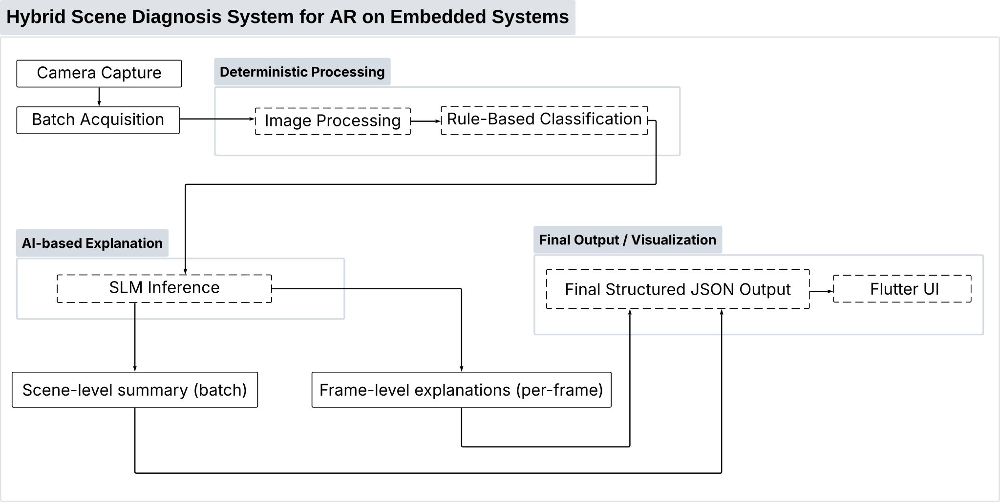
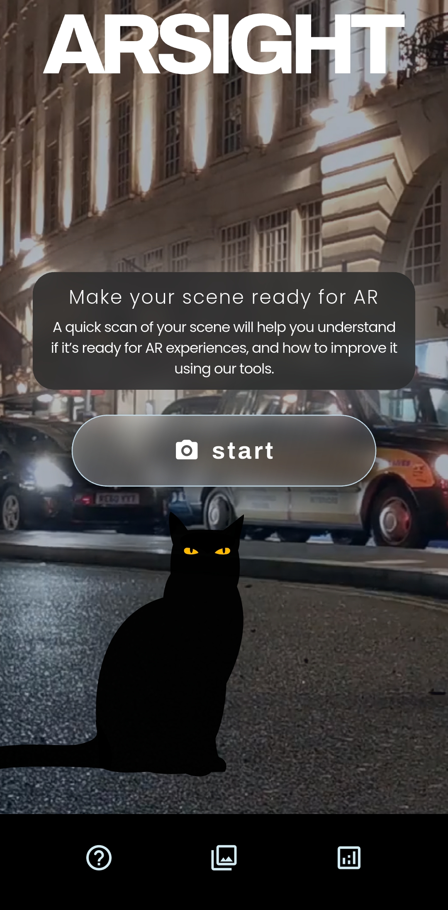
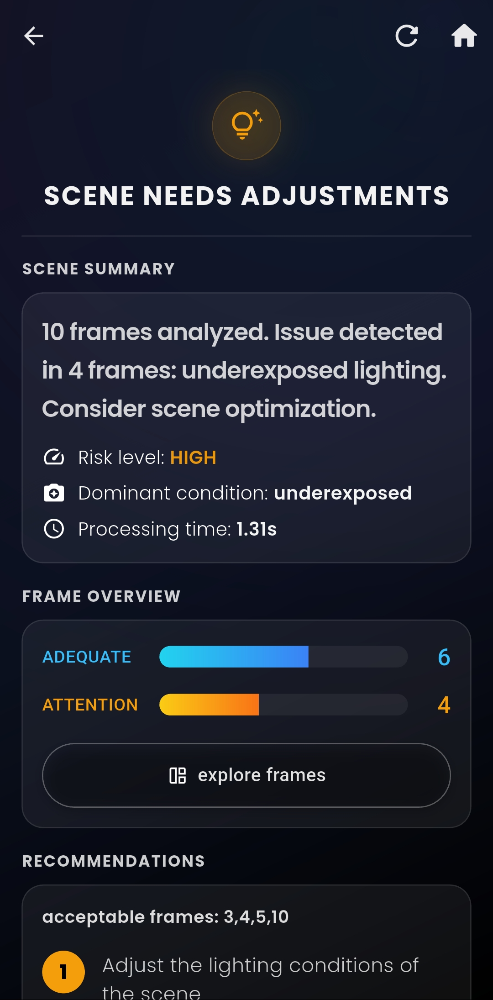
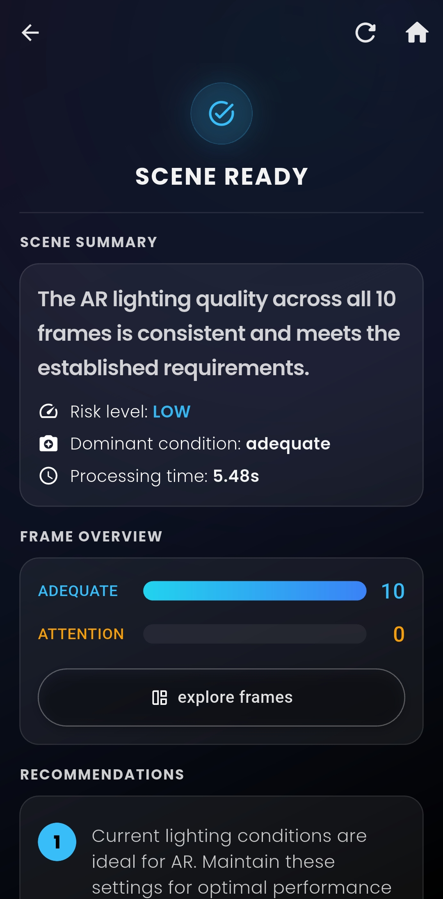
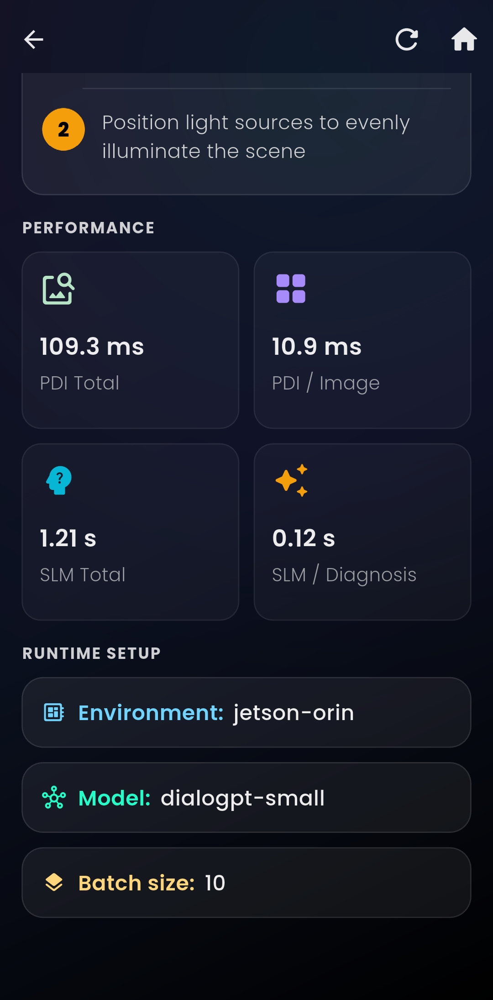

# AR Sight


**AR Sight** is a mobile Flutter application for augmented reality scene readiness diagnosis.

The app captures a short sequence of camera frames from a smartphone, uploads them to a configured backend, and displays a structured diagnosis with scene status, frame-level analysis, performance metrics, runtime setup information, and actionable recommendations.

This project was developed as part of a TCC research prototype focused on hybrid scene diagnosis pipelines for AR, combining deterministic image processing, backend inference, and user-facing explanations.

---

## Overview

AR Sight helps users understand whether a physical environment is suitable for augmented reality experiences.

The current prototype focuses on mobile scene capture and backend-assisted diagnosis. The intended usage is a smartphone-based scan: the user points the phone at the environment, captures a short sequence of frames, and receives feedback about scene conditions that may affect AR tracking stability.

The app is designed to connect to multiple configured backend environments, including desktop and embedded Jetson devices, while keeping the user experience centered on mobile capture.

---

## What It Does

- **Mobile Frame Capture**: Captures 10 frames over a 10-second scan using the device camera.
- **Batch Upload**: Sends captured frames to a configured backend using multipart upload.
- **Backend Diagnosis**: Starts diagnosis, polls processing status, and retrieves the final result.
- **Scene Readiness Report**: Displays pass/fail status, risk level, dominant condition, recommendations, and runtime metrics.
- **Frame Inspection**: Allows users to review captured frames and inspect frame-level diagnosis details.
- **Multi-Backend Setup**: Resolves available backend candidates through health checks.
- **Mobile-First Experience**: Built primarily for smartphone-based AR scene scanning.

---

## Application Workflow

AR Sight follows a four-phase workflow:

### 1. Capture

The mobile device camera captures a short sequence of frames during a 10-second scan.

The user is guided to move slowly, keep the phone steady, capture textured surfaces, and avoid reflections or motion blur.

### 2. Upload

The captured frames are sent to the backend as a batch using multipart upload.

The backend returns a batch_id, which is used to start and track the diagnosis process.

### 3. Diagnosis

The app starts the backend diagnosis for the uploaded batch and polls its status until processing is completed or failed.

The polling interval is configured per backend candidate, allowing slower embedded platforms to use longer intervals.

### 4. Results

The final backend response is adapted into structured UI models and displayed through result sections:

- Scene summary
- Frame overview
- Recommendations
- Performance metrics
- Runtime setup
- Frame-level inspection

---

## Architecture

AR Sight follows a layered Flutter architecture with external data sources, adapters, models, MobX state management, and presentation components.

```
lib/
└── src/
    ├── external/
    │   ├── adapters/
    │   ├── config/
    │   ├── datasources/
    │   └── services/
    ├── models/
    ├── presenter/
    │   ├── pages/
    │   └── stores/
    └── setup/
```

### Core Components

- **CameraService**: Captures image frames from the mobile camera at controlled intervals.
- **SceneUploadDatasource**: Uploads captured frames to the backend as a batch.
- **SceneDatasource**: Starts diagnosis, polls diagnosis status, and retrieves final results.
- **SceneDiagnosisAdapter**: Converts raw backend responses into structured UI models.
- **SceneEvalStore**: MobX store responsible for coordinating capture, upload, diagnosis, polling, result storage, and UI state updates.
- **BackendResolver**: Checks configured backend candidates and selects the first available backend.
- **BackendSession**: Stores the active backend and exposes its URL, timeouts, and polling configuration.

### Mobile-First Design

Although Flutter supports multiple platforms, AR Sight is designed primarily as a mobile application.

The core interaction depends on smartphone camera usage and physical movement through a real environment. For this reason, the main target is mobile deployment, especially Android during development and validation.

Desktop or web builds are not the primary goal of this project, because the diagnostic flow depends on camera-based scene scanning in an AR-like usage context.

---

## Features

- Mobile camera-based scene scanning
- 10-second capture flow with progress feedback
- Batch upload of captured frames
- Backend status polling
- Frame-level diagnosis visualization
- Recommendations grouped by scene condition
- Last captured frames shortcut
- Last diagnosis shortcut
- Runtime setup display
- Performance metrics display
- Fake datasources for UI development and testing
- Configurable backend candidates
- MobX-based reactive state management

---

## Backend Configuration

The app uses backend candidates defined in:

```
lib/src/external/config/api_config.dart
```

This file may contain local IP addresses, machine names, or lab-specific hostnames. For that reason, the real api_config.dart should not be committed.

Instead, version an example file:

```
lib/src/external/config/api_config.example.dart
```

Then copy it locally:

```bash
cp lib/src/external/config/api_config.example.dart lib/src/external/config/api_config.dart
```

### Example Configuration

```dart
import 'backend_candidate.dart';

class ApiConfig {
  static const List<BackendCandidate> candidates = [
    BackendCandidate(
      name: 'Jetson Orin',
      baseUrl: 'http://your-jetson-orin-host.local:8000',
      healthCheckTimeout: Duration(seconds: 5),
      diagnosisTimeout: Duration(seconds: 30),
      pollingIntervalSeconds: 1,
    ),
    BackendCandidate(
      name: 'Jetson Nano',
      baseUrl: 'http://your-jetson-nano-host.local:8000',
      healthCheckTimeout: Duration(seconds: 15),
      diagnosisTimeout: Duration(seconds: 240),
      pollingIntervalSeconds: 5,
    ),
    BackendCandidate(
      name: 'Desktop Workstation',
      baseUrl: 'http://your-desktop-host.local:8000',
      healthCheckTimeout: Duration(seconds: 5),
      diagnosisTimeout: Duration(seconds: 30),
      pollingIntervalSeconds: 1,
    ),
  ];
}
```


## Getting Started

### Prerequisites

- Flutter SDK 3.13.0 or higher
- Dart SDK 3.1.0 or higher
- Android SDK for mobile deployment
- A running compatible backend API
- A configured api_config.dart file

### Installation

```bash
# Clone repository
git clone https://github.com/yourusername/ar_sight.git
cd ar_sight

# Get dependencies
flutter pub get

# Generate MobX files
dart run build_runner build --delete-conflicting-outputs

# Configure local backend candidates
cp lib/src/external/config/api_config.example.dart lib/src/external/config/api_config.dart

# Run on a connected mobile device
flutter run
```

### Fake Backend Mode

The project includes fake datasources for UI development without a real backend.

This can be enabled in the store factory:

```dart
const bool useFakeBackend = true;
```

When fake mode is enabled, the app uses simulated upload and diagnosis responses. This is useful for testing UI states such as capture, upload, processing, recommendations, and result rendering.

---

## Technology Stack

- **[Flutter](https://flutter.dev/)** — Mobile UI framework
- **[Dart](https://dart.dev/)** — Application programming language
- **[MobX](https://pub.dev/packages/mobx)** — Reactive state management
- **[flutter_mobx](https://pub.dev/packages/flutter_mobx)** — Flutter integration for MobX
- **[Provider](https://pub.dev/packages/provider)** — Dependency injection
- **[Dio](https://pub.dev/packages/dio)** — HTTP client
- **[camera](https://pub.dev/packages/camera)** — Mobile camera access
- **[google_fonts](https://pub.dev/packages/google_fonts)** — Typography
- **[video_player](https://pub.dev/packages/video_player)** — Home background video
- **[flutter_svg](https://pub.dev/packages/flutter_svg)** — SVG logo rendering
- **[lottie](https://pub.dev/packages/lottie)** — Animated UI asset rendering

### Development Tools

- **[build_runner](https://pub.dev/packages/build_runner)** — Code generation orchestration
- **[mobx_codegen](https://pub.dev/packages/mobx_codegen)** — MobX generated store support
- **[flutter_lints](https://pub.dev/packages/flutter_lints)** — Recommended lint rules

---

## Project Structure

```
ar_sight/
├── lib/
│   ├── main.dart
│   └── src/
│       ├── external/
│       │   ├── adapters/
│       │   │   └── scene_diagnosis_adapter.dart
│       │   ├── config/
│       │   │   ├── api_config.example.dart
│       │   │   ├── backend_candidate.dart
│       │   │   ├── backend_resolver.dart
│       │   │   └── backend_session.dart
│       │   ├── datasources/
│       │   │   ├── fake_scene_datasource.dart
│       │   │   ├── fake_scene_upload_datasource.dart
│       │   │   ├── scene_datasource.dart
│       │   │   └── scene_upload_datasource.dart
│       │   └── services/
│       │       └── camera_service.dart
│       ├── models/
│       │   ├── frame_data.dart
│       │   ├── recommendation_group.dart
│       │   └── scene_diagnosis.dart
│       ├── presenter/
│       │   ├── pages/
│       │   │   ├── frames_preview/
│       │   │   ├── home/
│       │   │   ├── how_to/
│       │   │   ├── result/
│       │   │   └── scene_eval/
│       │   └── stores/
│       │       └── scene_eval_store.dart
│       └── setup/
│           └── store_factory.dart
├── assets/
├── test/
├── analysis_options.yaml
└── pubspec.yaml
```

---

## Development

### Code Generation

Generate MobX code after modifying stores:

```bash
dart run build_runner build --delete-conflicting-outputs
```

During development, watch mode can also be used:

```bash
dart run build_runner watch --delete-conflicting-outputs
```

### Running the App

Run on a connected mobile device:

```bash
flutter run
```

For Android release builds:

```bash
flutter build apk --release
```

or:

```bash
flutter build aab --release
```

---

## Performance Notes

The total execution time depends on the selected backend, model, hardware platform, and network conditions.

Current frontend behavior:

- **Capture**: 10 seconds for 10 frames at 1 Hz
- **Upload**: network-dependent
- **Diagnosis**: backend/model-dependent
- **Polling interval**: configured per backend candidate
- **Result rendering**: immediate after receiving the final backend response

The app also displays backend-reported metrics, including:

- PDI total time
- PDI time per image
- SLM total time
- SLM time per diagnosis
- Total diagnosis time
- Runtime setup information

---

## Main Use Cases

- AR scene readiness assessment
- ARCore testing support
- Mobile scene scanning for AR validation
- Human-readable recommendations for improving scene conditions
- Embedded backend validation with Jetson devices
- Edge AI benchmarking for visual diagnosis pipelines

---

## Pipeline & Screenshots

### Diagnosis Pipeline

The complete AR Sight workflow from capture to diagnosis results:



### Application Overview

Screenshots from the AR Sight mobile interface demonstrating the complete diagnostic workflow:

<div align="center">
  
  
  
  
  
  <p style="font-size: 0.85em; margin-top: 10px;">
    <strong>AR Sight Application Overview:</strong> (1) Home screen where the user initiates scene capture; 
    (2) Diagnostic result indicating scene adjustment required (risk: HIGH, dominant condition: underexposed); 
    (3) Passing result with adequate illumination (risk: LOW); 
    (4) Performance panel displaying processing time metrics and runtime configuration.
  </p>
</div>

---

## Related Repositories

The AR Sight mobile application integrates with diagnosis backends. The following repositories contain the backend services used in this project:

- **[backend_tcc_ar_sight](https://github.com/daniamorimdesa/backend_tcc_ar_sight)** — Primary backend reference implementation for AR scene diagnosis
- **[backend_tcc_mvp](https://github.com/daniamorimdesa/backend_tcc_mvp)** — Minimum viable product backend used during TCC research and validation

For backend integration details and setup instructions, see [Backend Integration](docs/BACKEND_INTEGRATION.md).

---

## Research Context

This application is part of a TCC project investigating hybrid scene diagnosis pipelines for augmented reality.

The broader research explores how deterministic image processing and small language models can be combined to produce structured, explainable, and resource-aware scene diagnostics for AR environments.

The mobile app acts as the user-facing interface of the system, connecting camera-based scene capture to backend diagnosis services deployed on different hardware environments.

---

## License

This project is licensed under the MIT License. See the [LICENSE](LICENSE) file for details.

---
## Academic Context

AR Sight was developed as the final project for the Robotics and Artificial Intelligence Residency / Postgraduate Program at CIn-UFPE.

The project is connected to a TCC research prototype investigating hybrid scene diagnosis pipelines for augmented reality, combining mobile scene capture, deterministic image processing, small language model explanations, and embedded backend deployment constraints.

---

## Author

**Daniela Amorim de Sá**  
Electronic Engineer from the Federal University of Pernambuco (UFPE)  
Robotics and Artificial Intelligence Residency / Postgraduate Program - CIn-UFPE

